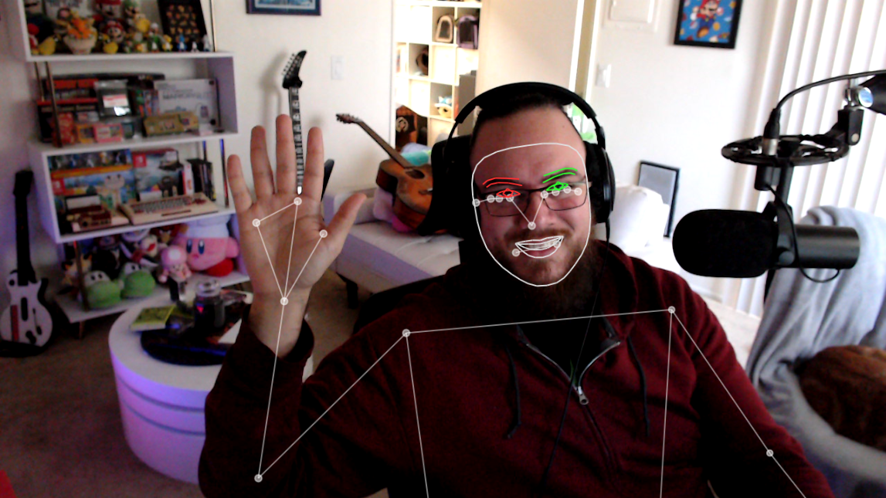

# Google MediaPipe Demo by [Joseph Writes Code](https://josephwritescode.substack.com)

This is a simple demo of [Google's MediaPipe](https://developers.google.com/mediapipe) library using TypeScript and React.



The implementation showcases the [Pose Landmarker](https://developers.google.com/mediapipe/solutions/vision/pose_landmarker) and [Face Landmarker](https://developers.google.com/mediapipe/solutions/vision/face_landmarker) detection models in real-time using the webcam.

Google MediaPipe is a powerful library for real-time machine learning inference. It's particularly useful for pose and face detection, and it's available as a WebAssembly module.

The underlying models are based on TensorFlow Lite, and the library is designed to be fast and efficient. It's a great choice for real-time applications, and it's relatively easy to use in the browser.

## Who is this for?

- **Web developers** who are curious about using MediaPipe in their projects.

## 💬 [Try chatting with a custom GPT about this repo!](https://chat.openai.com/g/g-zYpPrthfU-jwc-mediapipe-demonstrator)


## Installation

1. Clone this repository
2. Run **`npm install`** to install dependencies
3. The post-install script will automatically download the necessary MediaPipe models and wasm dependencies, and place them in the **`public`** directory.

## Usage

1. Run `npm run storybook` to start the Storybook server.

## Implemented Features

### `lib/MediaPipe.ts`

- This file offers a light abstraction layer for the MediaPipe library. Rather than using the MediaPipe JavaScript API directly, you can call `getVideoPoseLandmarker` and `getVideoFaceLandmarker` to instantiate the respective `PoseLandmarker` and `FaceLandmarker` models from MediaPipe.

- It also offers a few smoothing functions to help stabilize the landmark points.

  - `getLandmarkSmootherEWMA` uses an Exponential Weighted Moving Average to smooth the landmark points.

  - `getLandmarkSmootherKalman` uses a Kalman filter to smooth the landmark points. (This is implemented in `lib/KalmanFilter.ts`) You may find that this is more effective than the EWMA smoother, since you can tune the algorithm to the expected noise in the data.

### `components/<WebcamLandmarked>`

- This is a React component that uses the `lib/MediaPipe.ts` abstraction to display the webcam feed with the landmark points overlaid.

- It also offers a few props to control the landmark smoothing, or really perform whatever post-processing you would like on the landmark points.

  ```tsx
  import {createWebcamLandmarked} from "./WebcamLandmarked.tsx";
  import {getLandmarkSmootherEWMA} from "@/lib/MediaPipe.ts";

  const WebcamLandmarked = createWebcamLandmarked();

  <WebcamLandmarked
  	getLandmarkPostProcessingFn={() => getLandmarkSmootherEWMA({strength: 0.5})}
  />;
  ```

- :warning: **Note: The device delegation for inference is hard-coded to GPU.**

  - You may want to change this to CPU if you're running on a low-powered device. This can be done by modifying the `initPoseLandmarker` method in `components/WebcamLandmarked.tsx` as follows:

    ```tsx
    useEffect(() => {
    	(async function initPoseLandmarker() {
    		poseLandmarkerRef.current = await getVideoPoseLandmarker({
    			// Change to MEDIAPIPE.DELEGATE.CPU as needed.
    			delegate: MEDIAPIPE.DELEGATE.GPU,
    		});
    		faceLandmarkerRef.current = await getVideoFaceLandmarker({
    			// Change to MEDIAPIPE.DELEGATE.CPU as needed.
    			delegate: MEDIAPIPE.DELEGATE.GPU,
    		});
    	})();
    }, []);
    ```

    You could also modify this to be a prop of the component, though you will likely need to modify `useEffect` to handle the change in delegate.

- **Similarly, the default model used for Pose Estimation is always set to `"HEAVY"`**.

  - You can change this by also modifying the `initPoseLandmarker` method in `components/WebcamLandmarked.tsx` as follows:

    ```tsx
    useEffect(() => {
    	(async function initPoseLandmarker() {
    		poseLandmarkerRef.current = await getVideoPoseLandmarker({
    			// Change to "LITE", "HEAVY", or "FULL" as needed.
    			modelType: "HEAVY",
    			delegate: MEDIAPIPE.DELEGATE.GPU,
    		});
    		faceLandmarkerRef.current = await getVideoFaceLandmarker({
    			// There is no model option for Face Landmarking.
    			delegate: MEDIAPIPE.DELEGATE.GPU,
    		});
    	})();
    }, []);
    ```

### `components/<Webcam>`

- This is a simple React component that uses the `getUserMedia` API to display the webcam feed. It's used by `<WebcamLandmarked>`. You can use it as a standalone component if you need to display the webcam feed without any landmark detection.

## License

The demo is available as open source under the terms of the [MIT License](https://opensource.org/licenses/MIT).
